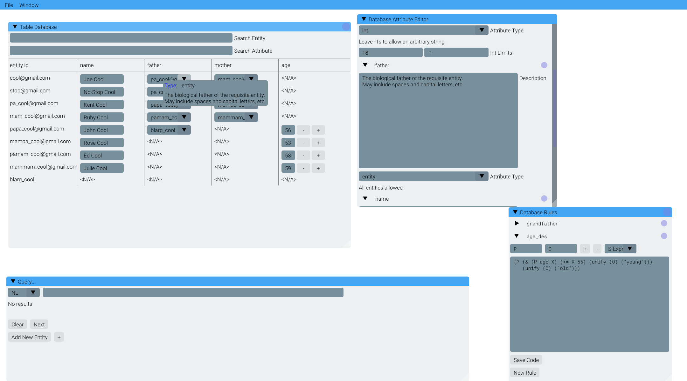

# Atomic Database 2.0



## What is Atomic Database

Atomic Database is a very simple entity-attribute-value database back end with a
series of layers in front:

1. A Logic programming langauge with access to the database, to answer questions
   about and undersand relations in the data. A simple S-expression syntax can
   also expose this in the final layer.
2. A Natural Language layer that decides whether you're asking something that
   the logic language needs to solve, or something that can be asked or put
   directly into the database.
3. A user interface to interact with all this.

The long and short of it is that you get a fairly decent actual database, suited
for very flexible, interactive datasets with not a lot of imposed structure,
that can answer complex and declaritive questions about its data based on both
local questions and knowledge about the data and how it relates that can be
programmed in ahead of time. Much of the abilities of logic programming
languages can be used to simulate SQL queries and such, but with much less
specific micromanaging, so it really is more akin to asking questions.

Atomic Database 1.0 had all of these features, in one form or another, but it
was pretty brittle and limited.

## What's New in Version Two?

The first version of Atomic Database, which is currently on the `master` branch,
was written in a hurry during a Hackathon with someone I had just met that day.
He was an amazing programmer but reading over his UI code after the fact, it set
in that I wouldn't be able to get the jQuery spagahetti that was left to do much
more. Worse, JavaScript really isn't designed to either be a stable,
self-contained binary or work as a ML and AI programming language. I was lucky I
had found some good libraries but the old code had reached most of its
potential, and worse, it wasn't going to run easily on my new computer. To solve
this, I decided to rewrite Atomic Database in Python. Python is not usually my
first choice for projects, but I do know it and it is the best language to do ML
related things in, specifically natural language processing in this case. Plus,
Kivy is a kick-ass UI library.

My plan looks like this at the moment:

- [X] Figure out how to package and distribute a stable binary.
- [X] Implement a more real-life EAV database. EAV databases aren't well
      recieved or much used in the wider industry, but they lend themselves
      really well to logic programming and natural language mapping. I'll try to
      use real algorithms from Wikipedia and other resources so it isn't just a
      2D array.
- [X] Figure out how to store databases
- [X] Implement a simple logic programming language. I didn't want to use
      another library like I did for Atomic Database 1.0 because this database
      has some very specific needs, and for AD1 that led to some very hacky,
      unstable code. Plus, implementing my own is fun!
- [X] Implement a Natural Language layer to interface with both the database or
      the logic language depending on what type of request is fed to it. This is
      going to be difficult to do reliably, so...
- [X] Make a simple S-expression language to interface more reliably and
      powerfully with the database. Call it a Pro-mode or something.
- [X] Implement a way to reference and store "rules" about the data relations in
      the database. This is a hugely important one.
- [X] Implement a UI in ImGUI. This can be simple: a list of text boxes on one
      side, each with an editable title and a "new" button below them for rules,
      and a table view on the other side for the actual database, and then a
      long query box at the bottom.
- [X] Add advanced language constructs such as `cond`, unification, scope.
- [x] Search functions should be available for entities, attributes. Use internal query system for this, but present a nice UI.
- [X] Add metadata relational database for attributes and (optionally) entities. This metadata should include:
    * Official name
      * Range of normal (or allowed) values
      * Data type
      * Description
      * (Auto generated) used by entities
- [X] Use metadata to display UI elements in the database view
- [X] Add validation and type-checking warnings (or errors!) to language and UI
- [X] Add lists
- [X] Add list support to attribute metadata
- [X] Typecheck list internals properly
- [X] Add immediate expressions and list descturing
- [X] Remove dynamic and static scope implementations and use lexical scope based on where things are defined. Make sure nested function calls only get data from their input variables. Create an optional way to access global variables
- [X] Make sure rules can call themselves, and check that unification works for recursive functions. Provide a way to iterate through using list destructuring
- [ ] Add automatic conversion to a relational database for export
- [X] Create a separate entity type to validate with, instead of strings
- [X] Focus on adding more variety to the NL recognizer
- [ ] Create a proper parser/evaluator for expressions, instead of `eval`ing them.
- [ ] Add immediate functions (that work inside expression delimiters) and can
      also be added as rows/columns to the Table View, so that it works like a
      spreadsheet.
- [ ] Extend the natural language interface to support some (all if possible!)
      advanced language constructs
- [ ] Create a chatbot (or "repl") interface for adding data and querying the
      database, where the history of your bindings and queries is interactable
      inline in the transcript, and when you click next on any result, the
      backtracking is visible
- [ ] Create an entity tree relation graph, and allow entity dropdowns to be
      turned into regular text at the user's convenience.
- [X] Create a way to externally save and load plain-test rules and query
      transcripts
- [X] Allow saving and loading of the database in plaintext
- [ ] Create a method of making UI elements and interfaces from inside rules
     (perhaps a main `createGUI` rule?)

## Requirements

You can use the `setup.rb` script provided in the home directory to install the
program files to `/opt` and the `atomicdb` script to `/usr/local/bin`. The
`atomicdb` script just excecutes the files in `/opt`. Note that running
`./setup.rb` by itself gives you a summary of what each command does:

```
You need to supply setup.rb with a command to tell it what to do!
Available commands:

    install         -- physically install Atomic Database (as atomicdb) to your computer
    develop         -- symlink Atomic Database so it runs as if it were `install`ed
    uninstall       -- undo all of the things develop or install did

Choose one of these commands please.
```

The requirements are stored in [requirements.txt](requirements.txt), generated
by `pip freeze`. The main packages you have to install if you can't use the
`requirements.txt` are:

- spaCy and `en_core_web_sm`
    * Which you can install by doing `python -m download en_core_web_sm` after
      you've installed spaCy
- `imgui[full]`
- `sexpdata`
- You will also need to install SDL2

To run, use:

```
python3 AtomicDatabase/__main__.py <name of database, or nothing>
```

Or, if you've used `setup.rb` to install/link the program, you can use:

```
atomicdb <name of database, or nothing>
```

## Screenshots

To find screenshots, look in the ["screenshots" directory](Screenshots/)

## Videos

Also coming soon!

## Contributing

If you want to contribute, **awesome**! The only rule is: never commit broken
code (if you know its broken). If you have questions, you can open issues for
them, I'll make a documentation label.
